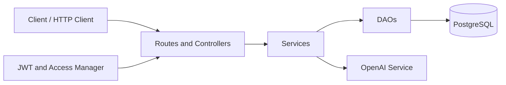
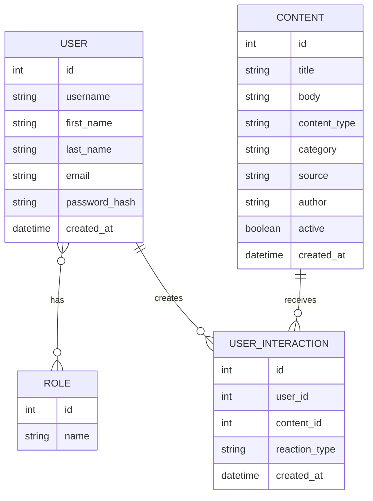

# eru

## Vision

eru is a backend API for a learning-focused scrolling platform built around short educational content such as facts, theories, and quotes.

The purpose of the project is to explore how a feed-style platform can be used for something more meaningful than passive entertainment by combining content management, authentication, user interactions, and optional AI-based elaboration.
  
---  

## Links

Portfolio website:    
https://cph-ds303.github.io/portfolio/projects/eru-project/

Project overview video (max 5 min):    
https://drive.google.com/drive/folders/11miq5ZiHGOEkeZKAQC2lV419AwaSLrsV?usp=sharing

Deployed application:    
https://eru-api.dk/api/v1/routes

Source code repository:    
https://github.com/cph-ds303/eru.git
  
---  

# Architecture

## System Overview

eru is built as a layered backend architecture with a clear separation of responsibilities:

- **Controller layer** handles HTTP endpoints, request parsing, and response formatting
- **Service layer** contains business rules and validation logic
- **DAO layer** manages persistence through JPA / Hibernate
- **Entity layer** models the core domain
- **Configuration layer** wires the application together and applies authentication, logging, and exception handling

**Technologies used:**

- Java 17
- Javalin 7
- Hibernate ORM 7 + JPA
- PostgreSQL
- Maven
- JWT authentication (`java-jwt`)
- BCrypt password hashing
- Jackson
- SLF4J + Logback
- JUnit 5
- Rest Assured + Hamcrest
- Testcontainers
- Docker
- GitHub Actions
- OpenAI API integration (optional)

---  

## Architecture Diagram



The application is exposed under the base path `/api/v1`. Route protection is handled through Javalin role checks combined with JWT validation, while persistence is handled through Hibernate-backed DAOs.
  
---  

## Key Design Decisions

### Layered Project Structure

The project is intentionally structured as a classic layered backend. Controllers are responsible for HTTP concerns, services hold business logic, and DAOs handle database access. This keeps responsibilities narrow and makes the request flow easier to explain, test, and maintain.

### Authentication and Authorization

Authentication is implemented using JWT tokens. A user registers or logs in, receives a signed token, and includes that token in subsequent authenticated requests.

Authorization is enforced through route-level roles (`ANYONE`, `USER`, `ADMIN`). Public endpoints such as health checks and content browsing remain open, while personal endpoints require `USER` access and content administration requires `ADMIN` access.

### Runtime Configuration

Application bootstrapping is split into `ApplicationConfig`, `DependencyContainer`, and `Routes`. This keeps startup logic, dependency wiring, and route registration separate and easier to reason about.

Configuration is primarily environment-based, with support for an optional local `config.properties` file. This was chosen to support both local development and deployed environments.

### Error Handling

Known API failures are represented through `ApiException`, which carries an HTTP status and an application error code. These exceptions are returned in a controlled JSON format, while unexpected failures are logged and returned as generic internal server errors.

### Optional AI Integration

AI functionality is isolated behind a dedicated endpoint and service. The OpenAI integration is only enabled when the required API key is present. This keeps the rest of the application independent of the external AI dependency.

### Testing Strategy

The project combines service-level unit tests with integration tests using Testcontainers and PostgreSQL. End-to-end API tests are written both with Java's built-in `HttpClient` and with Rest Assured, which makes it possible to test isolated business logic as well as expressive HTTP-level assertions against a real database.
  
---  

# Data Model

## ERD



## Important Entities

### User

Represents a registered user in the platform.

**Fields:**

- `id` — auto-generated primary key
- `username` — unique username used for login
- `firstName` — user's first name
- `lastName` — user's last name
- `email` — unique email address
- `passwordHash` — BCrypt-hashed password
- `createdAt` — creation timestamp
- `roles` — assigned security roles

### Role

Represents a security role used for authorization.

**Fields:**

- `id` — auto-generated primary key
- `name` — unique role name such as `USER` or `ADMIN`

### Content

Represents an educational content item shown in the platform.

**Fields:**

- `id` — auto-generated primary key
- `title` — short title
- `body` — main content text
- `contentType` — `FACT`, `THEORY`, or `QUOTE`
- `category` — optional category such as technology or nature
- `source` — optional source reference
- `author` — optional author reference
- `active` — whether the content is active
- `createdAt` — creation timestamp

### UserInteraction

Represents a user's reaction to a content item.

**Fields:**

- `id` — auto-generated primary key
- `user` — the user who made the interaction
- `content` — the content item being interacted with
- `reactionType` — interaction type such as `LIKE`, `BOOKMARK`, `DISLIKE`, `VIEW`, or `ELABORATE`
- `createdAt` — creation timestamp

---  

# API Documentation

All endpoints are exposed under:

```text  
/api/v1  
```  

Known API errors are returned in this format:

```json  
{  
  "errorCode": "ERROR_CODE",  "message": "Human-readable explanation"}  
```  

## Auth

| Method | URL | Request Body | Response | Status |  
|---|---|---|---|---|  
| POST | `/auth/register` | `RegisterRequestDTO` | `AuthResponseDTO` | 201 / 400 |  
| POST | `/auth/login` | `AuthRequestDTO` | `AuthResponseDTO` | 200 / 400 |  
| POST | `/auth/logout` | - | No body | 204 / 401 |  
| GET | `/auth/me` | - | `CurrentUserDTO` | 200 / 401 |  
| POST | `/auth/roles` | `AddRoleRequestDTO` | `UserDTO` | 200 / 400 / 403 |  

### RegisterRequestDTO

```json  
{  
  "firstName": "Student",  "lastName": "One",  "email": "student1@example.com",  "username": "student1",  "password": "secret123"}  
```  

### AuthRequestDTO

```json  
{  
  "username": "student1",  "password": "secret123"}  
```  

### AuthResponseDTO

```json  
{  
  "token": "JWT_TOKEN",  "userId": 1,  "username": "student1"}  
```  

## Content

| Method | URL | Request Body | Response | Status |  
|---|---|---|---|---|  
| GET | `/content` | - | `[ContentDTO]` | 200 |  
| GET | `/content?type=FACT` | - | `[ContentDTO]` | 200 / 400 |  
| GET | `/content?activeOnly=true` | - | `[ContentDTO]` | 200 |  
| GET | `/content/{id}` | - | `ContentDTO` | 200 / 404 |  
| POST | `/content` | `ContentRequestDTO` | `ContentDTO` | 201 / 400 / 403 |  
| PUT | `/content/{id}` | `ContentRequestDTO` | `ContentDTO` | 200 / 400 / 403 / 404 |  
| DELETE | `/content/{id}` | - | No body | 204 / 403 / 404 |  

### ContentRequestDTO

```json  
{  
  "title": "Did you know?",  "body": "Honey never spoils.",  "contentType": "FACT",  "category": "Science",  "source": "Smithsonian",  "author": "Unknown"}  
```  

### ContentDTO

```json  
{  
  "id": 1,  "title": "Did you know?",  "body": "Honey never spoils.",  "contentType": "FACT",  "category": "Science",  "source": "Smithsonian",  "author": "Unknown",  "active": true,  "createdAt": "2026-04-09T10:20:15"}  
```  

## Interactions

| Method | URL | Request Body | Response | Status |  
|---|---|---|---|---|  
| POST | `/content/{id}/interactions` | `InteractionRequestDTO` | `InteractionDTO` | 200 / 400 / 401 / 404 |  
| GET | `/content/{id}/interactions` | - | `[InteractionDTO]` | 200 / 404 |  
| GET | `/interactions/me` | - | `[UserContentInteractionDTO]` | 200 / 401 |  
| GET | `/interactions/me?reactionType=BOOKMARK` | - | `[UserContentInteractionDTO]` | 200 / 400 / 401 |  

### InteractionRequestDTO

```json  
{  
  "reactionType": "BOOKMARK"}  
```  

### UserContentInteractionDTO

```json  
{  
  "id": 7,  "reactionType": "BOOKMARK",  "createdAt": "2026-04-09T10:20:15",  "content": {    "id": 1,    "title": "Did you know?",    "body": "Honey never spoils.",    "contentType": "FACT",    "category": "Science",    "source": "Smithsonian",    "author": "Unknown",    "active": true,    "createdAt": "2026-04-09T10:20:15"  }}  
```  

## AI

| Method | URL | Request Body | Response | Status |  
|---|---|---|---|---|  
| POST | `/ai/elaborate` | `ElaborateRequestDTO` | `ElaborateResponseDTO` | 200 / 400 / 401 / 500 |  

### ElaborateRequestDTO

```json  
{  
  "title": "Black holes",  "body": "A black hole is a region in space where gravity is extremely strong."}  
```  

## Utility Endpoints

| Method | URL | Purpose | Status |  
|---|---|---|---|  
| GET | `/` | Basic application status | 200 |  
| GET | `/health` | Health check endpoint | 200 |  
| GET | `/routes` | Route overview plugin | 200 |  
  
---  

# User Stories

The following user stories represent the implemented scope of the project:

- As a new user, I want to create an account with my first name, last name, email, username, and password, so that I can access the platform as a registered user.
- As a returning user, I want to log in and log out securely, so that my account remains protected.
- As an authenticated user, I want to retrieve my current user information and roles, so that I can verify my identity and access level.
- As a user, I want to browse all available content or retrieve a single content item, so that I can explore educational material.
- As a user, I want to filter content by type, so that I can focus on facts, theories, or quotes.
- As an authenticated user, I want to react to content with actions such as like or bookmark, so that I can save or mark relevant content.
- As an authenticated user, I want to view my own interactions and filter them by reaction type, so that I can revisit bookmarked content.
- As a user, I want to request AI-based elaboration of a content item, so that I can gain a deeper explanation of the topic.
- As an admin, I want to create, update, and delete content, so that the platform’s content library can be maintained.
- As an admin, I want to assign roles to users, so that access to protected functionality can be controlled.

Future user stories that fit the current project direction include:

- As an authenticated user, I want to update my profile information, so that my account details remain current.
- As an authenticated user, I want to change my password, so that I can maintain account security over time.
- As a user, I want to search for content by keyword or topic, so that I can quickly find relevant material.
- As a user, I want to avoid seeing the same content repeatedly, so that the feed feels fresh and engaging.
- As an admin, I want to view and manage users, so that platform moderation can be handled more effectively.
- As a user, I want personalized recommendations based on my interactions, so that my feed becomes more relevant over time.  
